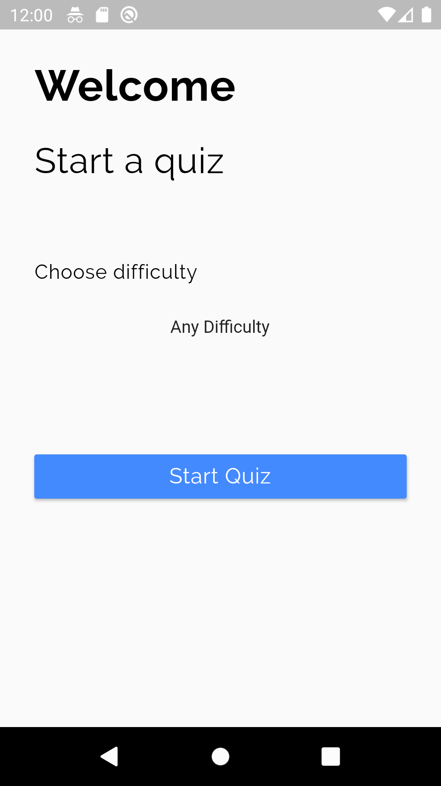
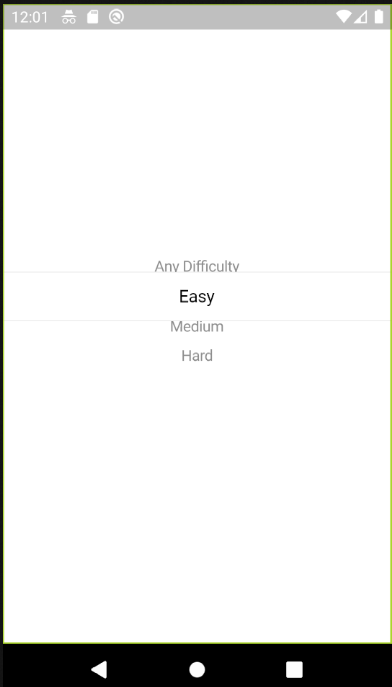
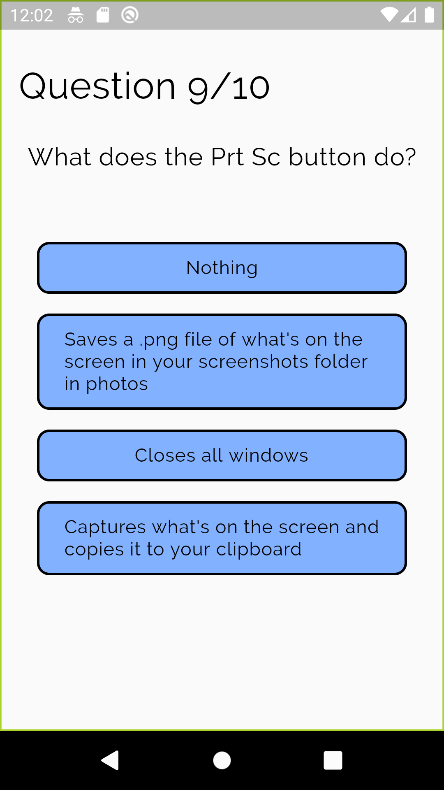
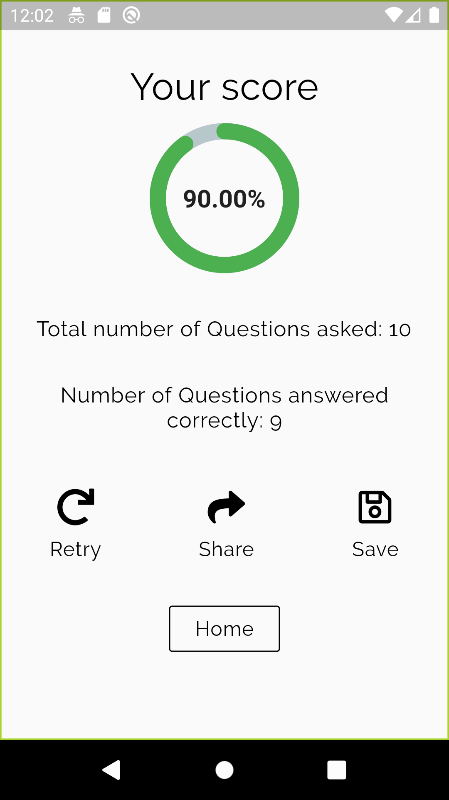
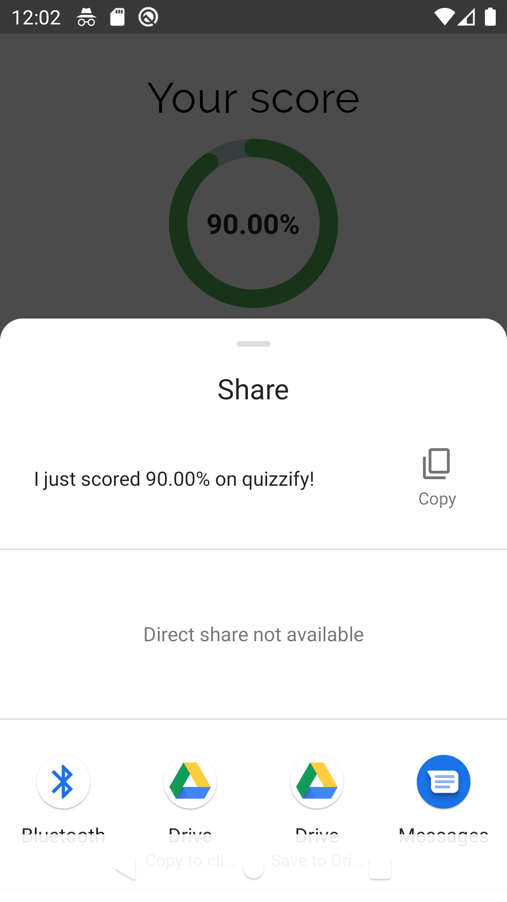
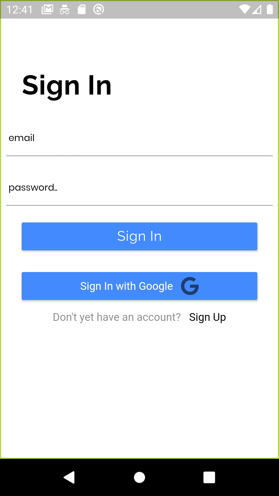

# quizzify

### A simple Flutter Quiz application.

After the quiz, the results can be shared to other apps on the user's phone. The user can also decide to retake the same quiz again. The save icon leads the user to a sign-in route, the user is then logged in. However the saving of scores functionality hasn't been fully implemented.
Arigato!

| - | - | - |
|:---:|:---:|:---:|
||||
||||
